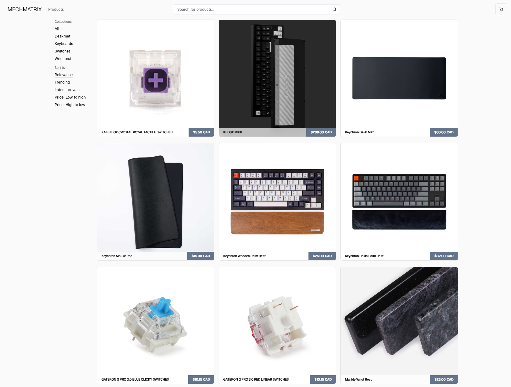
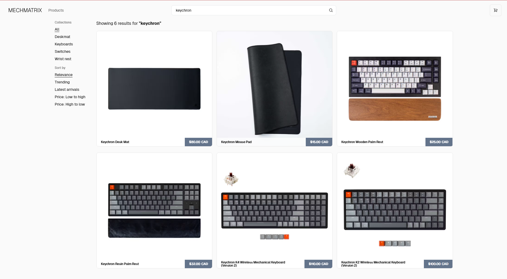
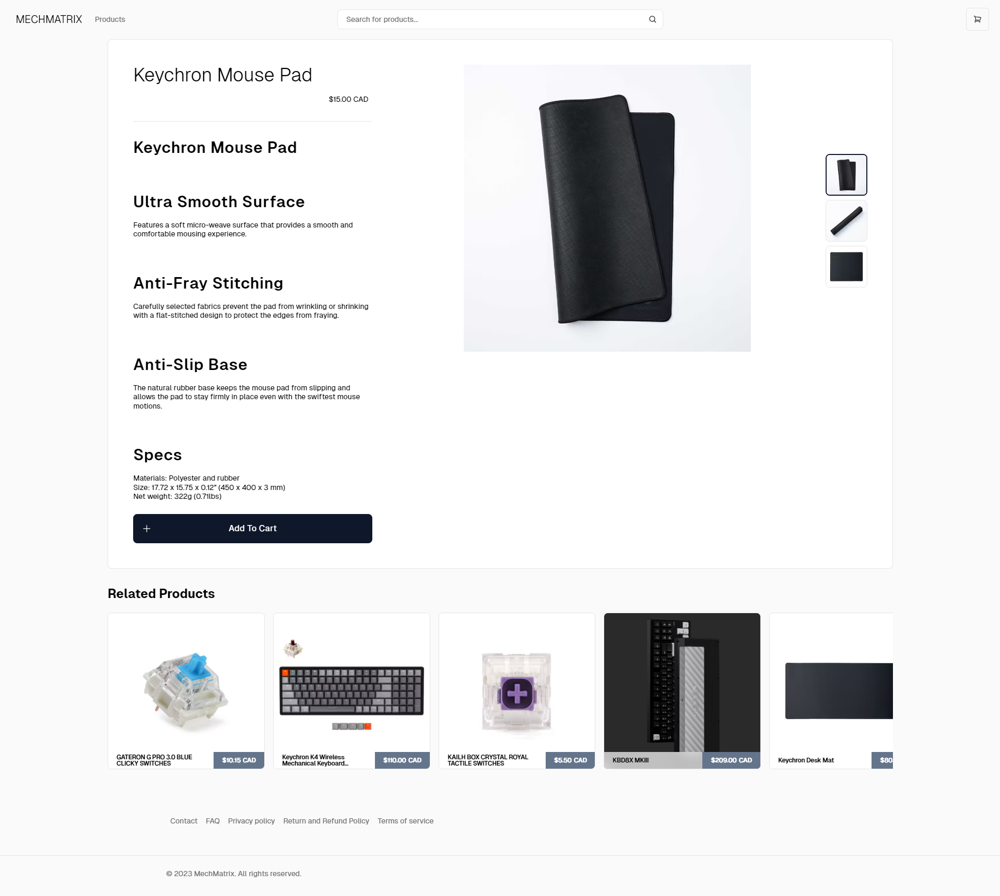
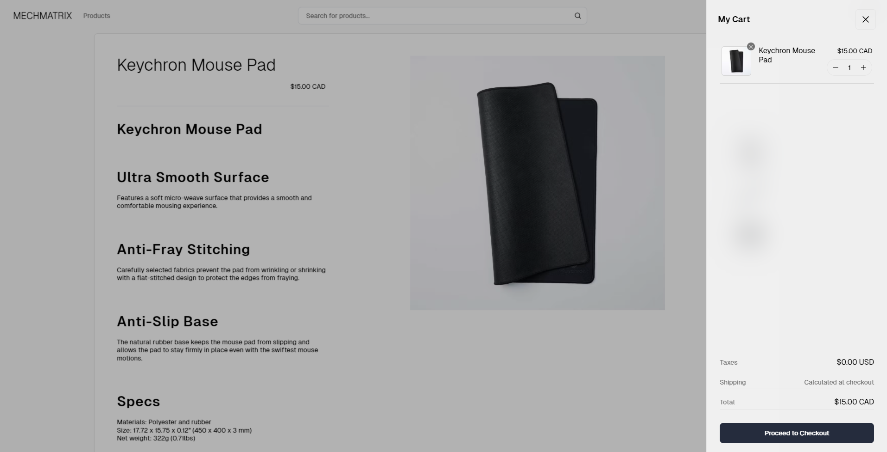

# MECHMATRIX - Shopify eCommerce

Welcome to MECHMATRIX, the ultimate destination for keyboard enthusiasts! Our Shopify-powered webstore specializes in offering a wide range of high-quality keyboards, deskmats, switches, and wrist rests. Leveraging the power of Shopify for robust e-commerce capabilities, MECHMATRIX goes a step further by integrating Next.js to elevate the user interface and overall user experience.

## Description

MECHMATRIX isn't just another e-commerce store; it's a seamless blend of Shopify's powerful e-commerce features with the cutting-edge web development capabilities of Next.js. This integration ensures that our customers enjoy a fast, responsive, and engaging shopping experience.

### Key Features:

- Next.js App Router: Utilizing the latest in web routing for smoother and more dynamic page transitions.
- Optimized for SEO: Leverage Next.js's metadata optimization to ensure your products are easily discoverable.
- React Server Components (RSCs) and Suspense: Implementing modern React features for efficient data fetching and improved performance.
- Server Actions for Mutations: Enhance user interactions with server-side logic for a more dynamic experience.
- Edge Runtime: Utilizing Next.js’s edge runtime for faster, more efficient delivery of web content.
- Dynamic OG Images: Automatically generate optimized images for sharing on social platforms.
- Styling with Tailwind CSS: Craft a unique and responsive design with the utility-first CSS framework.
- Shopify for Checkout and Payments: Rely on Shopify's secure and efficient checkout and payment processing.

### Technologies Used:

- Shopify: For robust e-commerce functionalities and secure payment processing.
- Next.js 14: Leading framework for React, providing features like App Router, RSCs, and Edge Runtime.
- Tailwind CSS: For efficient and responsive design implementation.
- React 18: Leveraging the latest React features for optimal UI rendering.
- Node.js & TypeScript: Ensuring robust backend functionality and strong typing for development.
- ESLint & Prettier: Code quality and formatting tools to maintain high coding standards.

## Screenshots

## How to Install and Run

### Install

1. Clone the repository: git clone `https://github.com/KBMaglalang/mechmatrix`
2. Navigate to the directory: `cd mechmatrix`
3. Install dependencies: `pnpm install`
4. Copy `.env.example` to `.env`
5. Populate the `.env` file with necessary values and permissions.

### Run

1. Start the server: `pnpm dev`
2. Access the app at localhost:3000 or the provided link in the terminal
